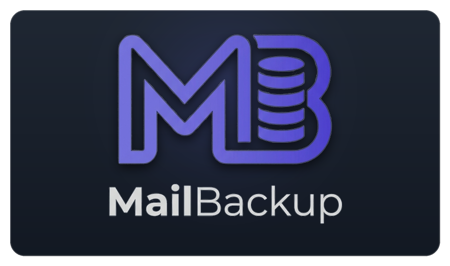

<div align="center">
  

  # MailBackup Studio 📬

  <p><strong>A high-performance, resilient, and non-destructive Email Backup Utility written in Rust.</strong></p>

  <p>
    
    
    
    
  </p>
</div>

Built with a modular architecture featuring:
- **CLI**: Rapid commands with Rich progress bars, interactive setup wizard, FTS5 search, and headless daemon.
- **Embedded Web UI**: Modern dark-mode SPA (HTML5, Vanilla CSS, JS) embedded directly in the binary with zero external runtime dependencies.
- **Desktop GUI**: Native desktop application with system tray integration and notifications via Tauri.
- **Raw Fidelity Storage**: Lossless `.eml` files (RFC 822/5322) preserving headers, attachments, and signatures bit-for-bit.
- **Mbox Export**: On-demand and scheduled export to standard RFC 4155 `.mbox` archives.
- **Strictly Non-Destructive**: Never deletes messages from remote mail servers (`EXAMINE` read-only IMAP mode).
- **SQLite Catalog & FTS5**: Sub-second full-text search across all accounts, subjects, senders, body texts, and attachment names.
- **Configurable Retention**: Automatic local pruning policy (e.g. retain 90 days, 1 year, or keep forever).
- **Security**: OS Keyring integration (macOS Keychain, Windows Credential Manager, Linux Secret Service) with secure local fallback.

---

## Workspace Structure

```
├── Cargo.toml                    # Root workspace configuration
├── crates
│   ├── mailbackup-core           # Core engine: IMAP, SQLite FTS5, Storage, Mbox, Retention, Scheduler
│   ├── mailbackup-cli            # Command-line interface binary (`mailbackup`)
│   ├── mailbackup-server         # REST API server & embedded Web UI (`mailbackup-server`)
│   └── mailbackup-gui            # Native Desktop GUI with System Tray (`mailbackup-gui`)
```

---

## Getting Started

### 1. Build All Binaries

```bash
cargo build --release --workspace
```

### 2. Using the CLI

```bash
# Add an account interactively
cargo run -p mailbackup-cli -- account add

# List configured accounts and storage stats
cargo run -p mailbackup-cli -- account list

# Test IMAP connection
cargo run -p mailbackup-cli -- account test <account_id>

# Run incremental backup
cargo run -p mailbackup-cli -- sync

# Search email archives with instant FTS5 matching
cargo run -p mailbackup-cli -- search "invoice"

# Export a folder or entire account to .mbox
cargo run -p mailbackup-cli -- export-mbox --account <id> --output ./archive.mbox

# Run background scheduled sync daemon
cargo run -p mailbackup-cli -- daemon

# Launch Web Studio
cargo run -p mailbackup-cli -- serve --port 8765
```

### 3. Launching the Web Studio

```bash
cargo run -p mailbackup-server
```

Open your browser at `http://127.0.0.1:8765` to access the full offline email browser, attachment previewer, and account manager.

### 4. Running the Desktop GUI

```bash
cargo run -p mailbackup-gui
```

---

## Running Automated Tests

```bash
cargo test --workspace
```
